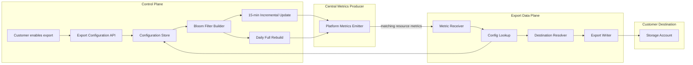

```mermaid
flowchart LR
    subgraph ControlPlane[Control Plane]
        A[Customer enables export]
        B[Export Configuration API]
        C[Configuration Store]
        D[Bloom Filter Builder]
        E[15-min Incremental Update]
        F[Daily Full Rebuild]
    end

    subgraph Source[Central Metrics Producer]
        G[Platform Metrics Emitter]
    end

    subgraph Export[Export Data Plane]
        H[Metric Receiver]
        I[Config Lookup]
        J[Destination Resolver]
        K[Export Writer]
    end

    subgraph Sink[Customer Destination]
        L[Storage Account]
    end

    A --> B --> C
    C --> D
    D --> E --> G
    D --> F --> G
    G -->|matching resource metrics| H
    H --> I --> C
    I --> J --> K --> L
```