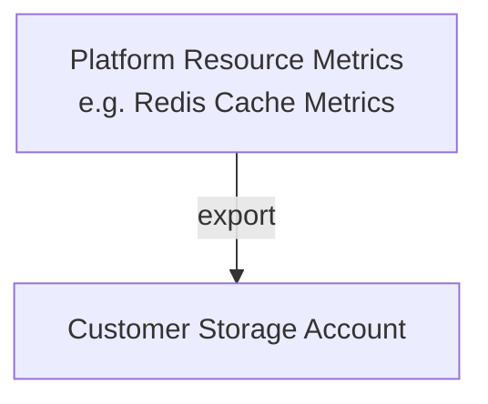
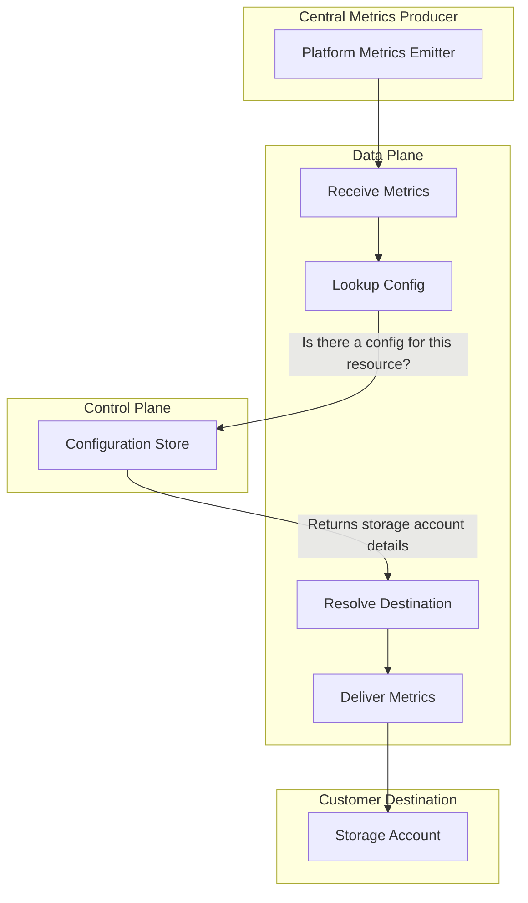
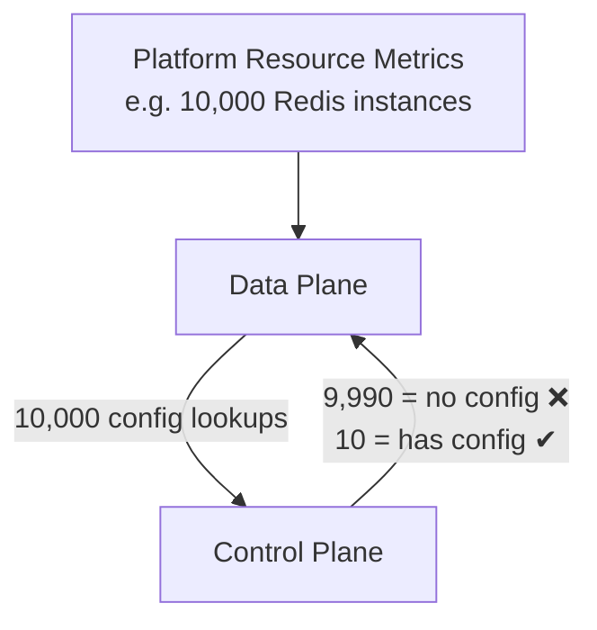
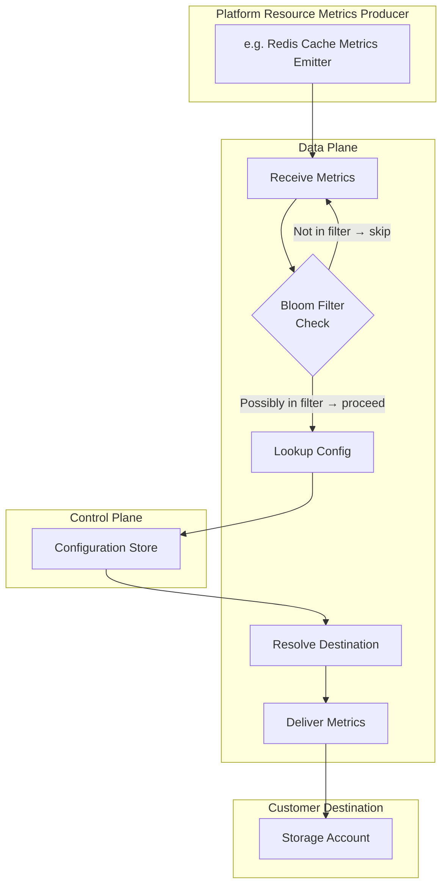
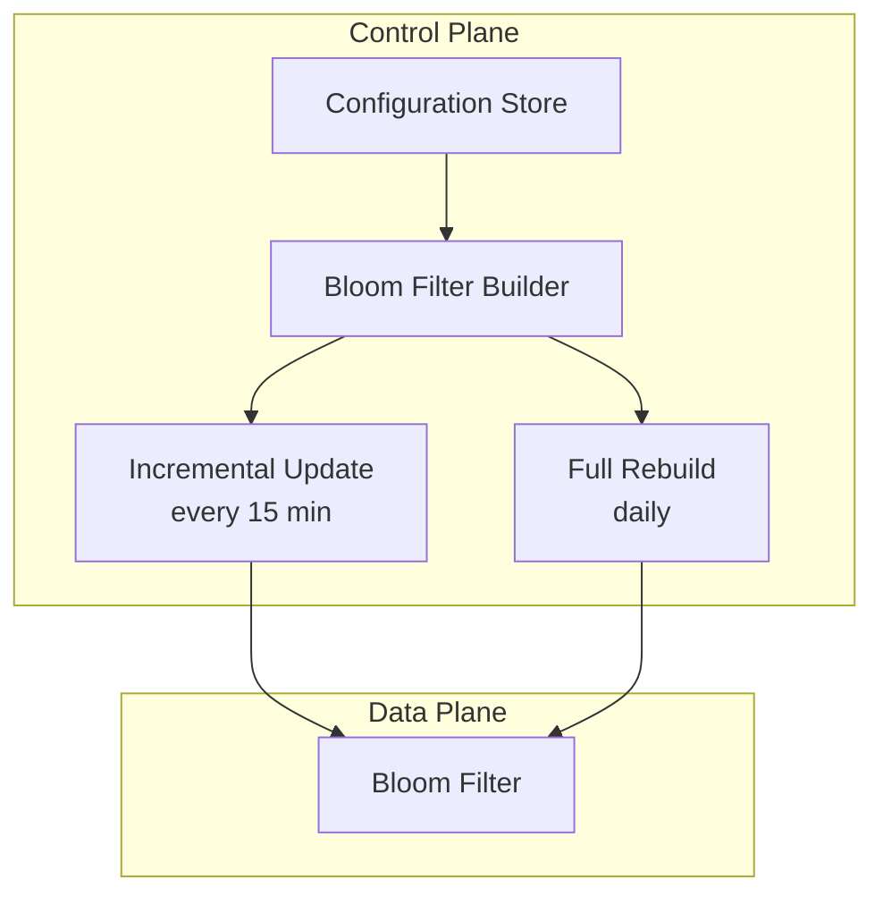

# Metrics Export to Customer Storage

## 1. Goal

Deliver platform resource metrics (e.g. Redis cache metrics) from a central cache to cloud customers who have opted in, routing each customer's metrics to their designated storage account.

---

## 2. Basic Flow

A **Central Producer** emits metrics. The **Data Plane** receives them, calls the **Control Plane** to look up whether an export configuration exists for that resource, retrieves the destination storage account details, and delivers the metrics.

---

## 3. The Problem: Excessive Control Plane Calls

In practice, only a tiny fraction of resources have export enabled — perhaps **10 out of 10,000**. Without any filtering, the Data Plane makes a Control Plane lookup for **every** metric it processes, meaning ~9,990 out of every 10,000 calls return "no config found" and are completely wasted.

This creates unnecessary load on the Control Plane and adds latency to the export path.

---

## 4. Solution: Introduce a Bloom Filter

A **Bloom filter** is placed in the Data Plane as a lightweight, in-memory pre-check. Before calling the Control Plane, the Data Plane checks the Bloom filter:

- **Not in filter** → skip the lookup entirely (guaranteed no config exists)
- **In filter** → proceed with the Control Plane call (may be a true positive or a rare false positive)

This eliminates the vast majority of unnecessary calls.

---

## 5. Managing the Bloom Filter

The Bloom filter must stay in sync with the Control Plane's configuration. Two mechanisms keep it current:

| Mechanism | Frequency | Purpose |
|---|---|---|
| **Incremental Update** | Every 15 minutes | Picks up recent config additions/changes quickly |
| **Full Rebuild** | Daily | Corrects any drift; removes stale entries by rebuilding from scratch |

The Control Plane builds the filter and pushes it to the Data Plane.

