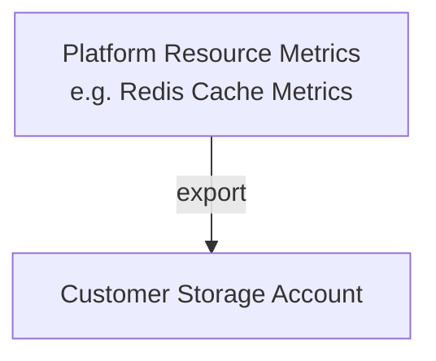
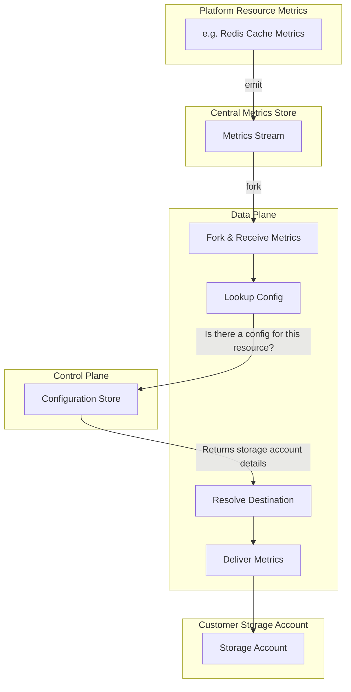
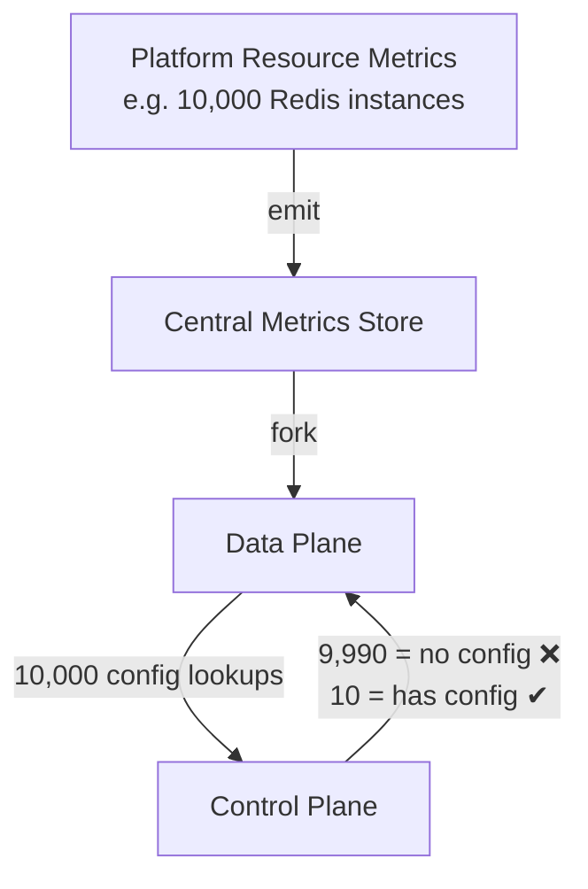
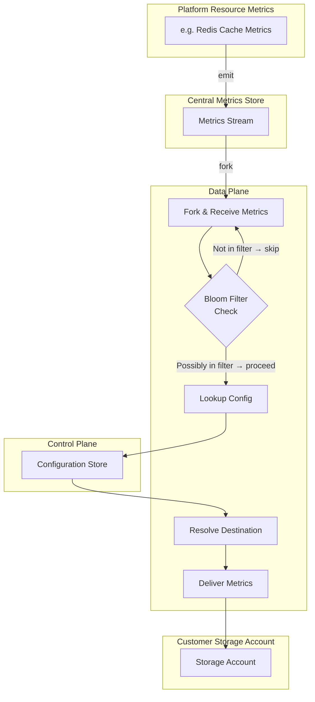
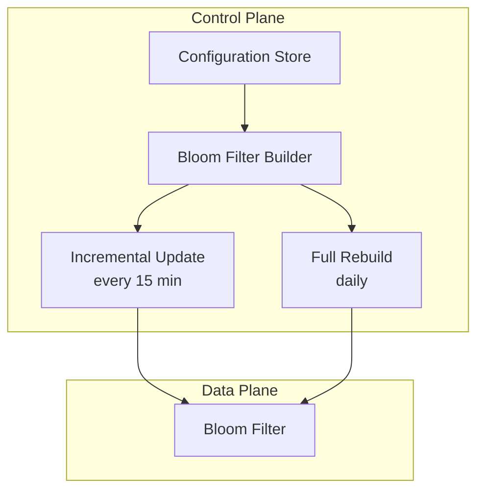

# Metrics Export to Customer Storage

## 1. Goal

---

## 2. Basic Flow

---

## 3. The Problem: Excessive Control Plane Calls

---

## 4. Solution: Introduce a Bloom Filter

---

## 5. Managing the Bloom Filter

