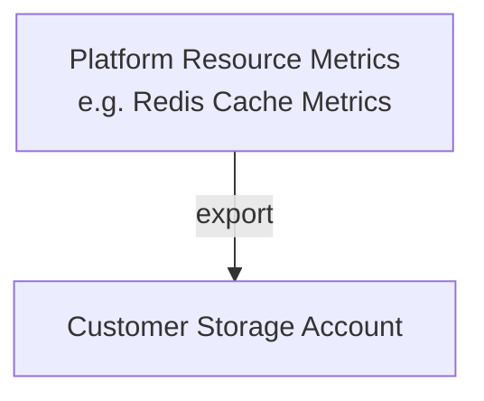
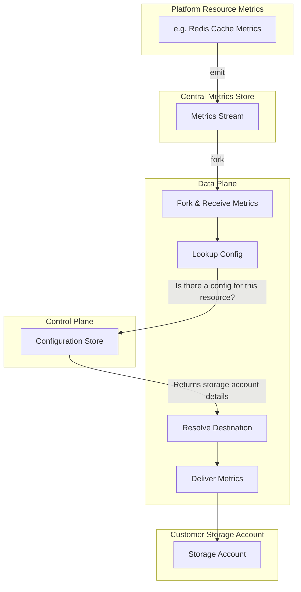
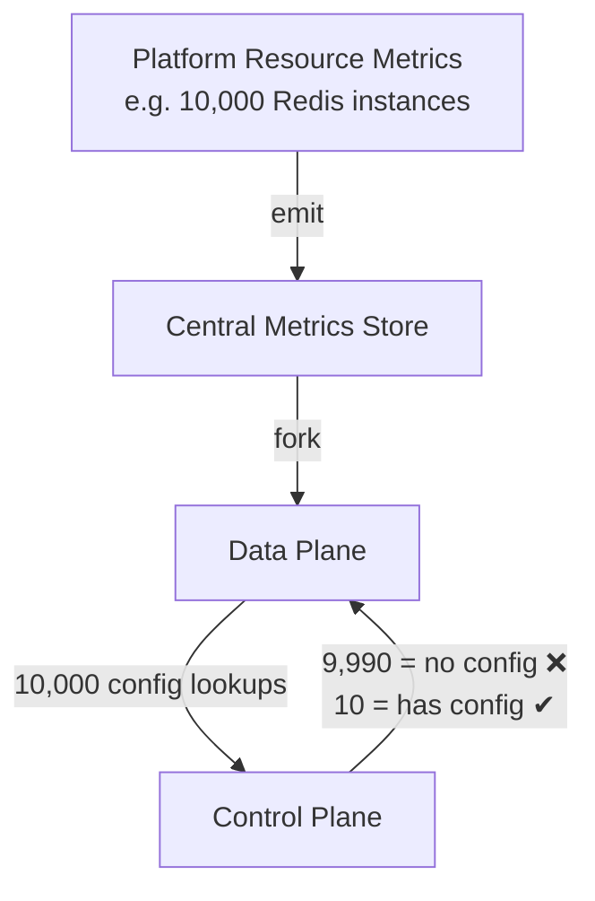
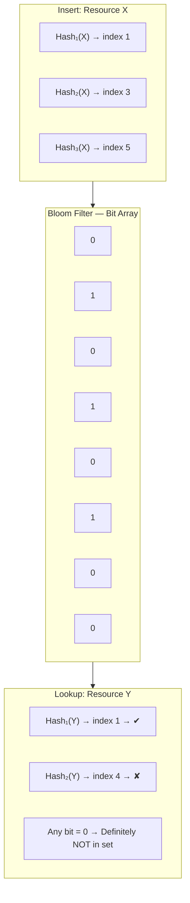
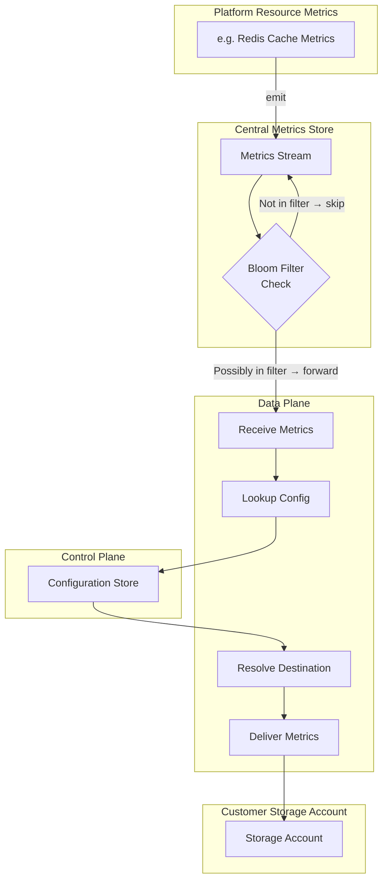
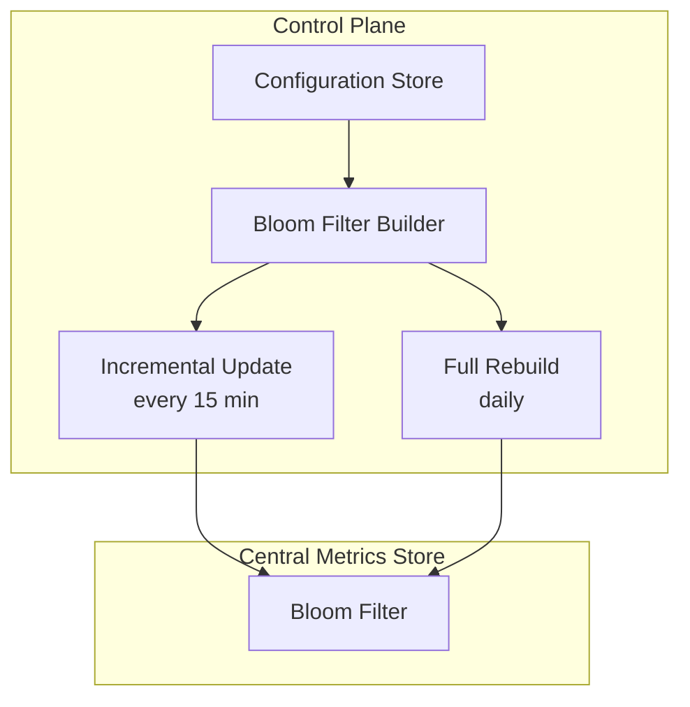

# Metrics Export to Customer Storage

## 1. Goal



---

## 2. Basic Flow



---

## 3. The Problem: Excessive Control Plane Calls



---

## 3.5 How a Bloom Filter Works



```
Insert: hash the resource ID → set bits at those positions to 1.
Lookup: hash the resource ID → check bits.
  • All bits = 1  → Possibly in set (proceed with Control Plane call)
  • Any bit  = 0  → Definitely NOT in set (skip — no config exists)
  • False positives possible, false negatives never.
```

---

## 4. Solution: Introduce a Bloom Filter



---

## 5. Managing the Bloom Filter

