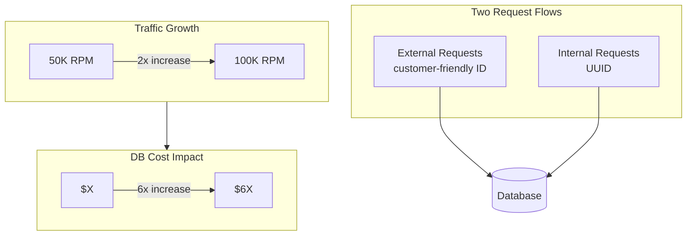
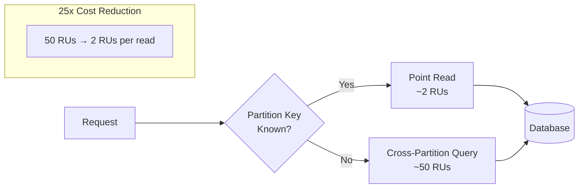
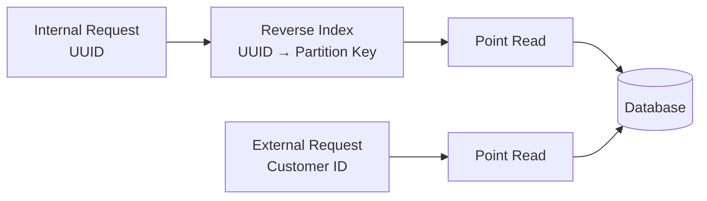
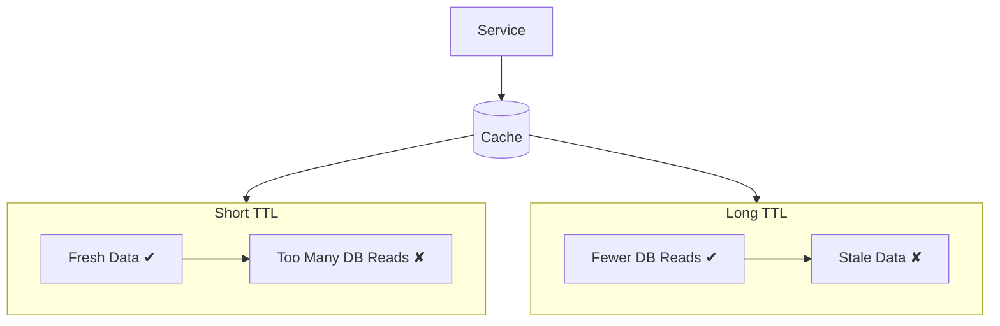
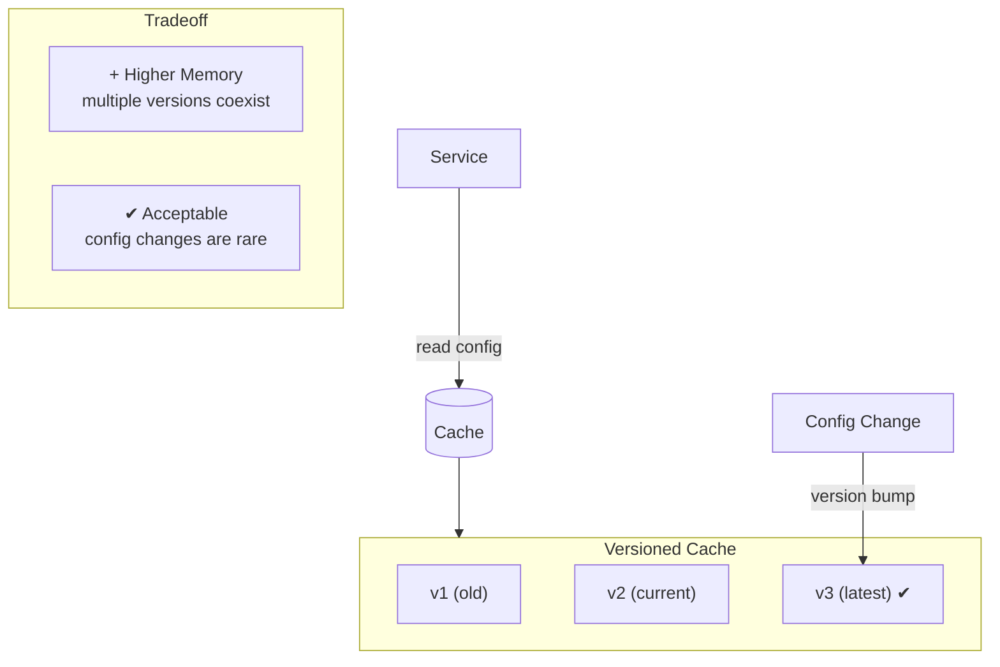
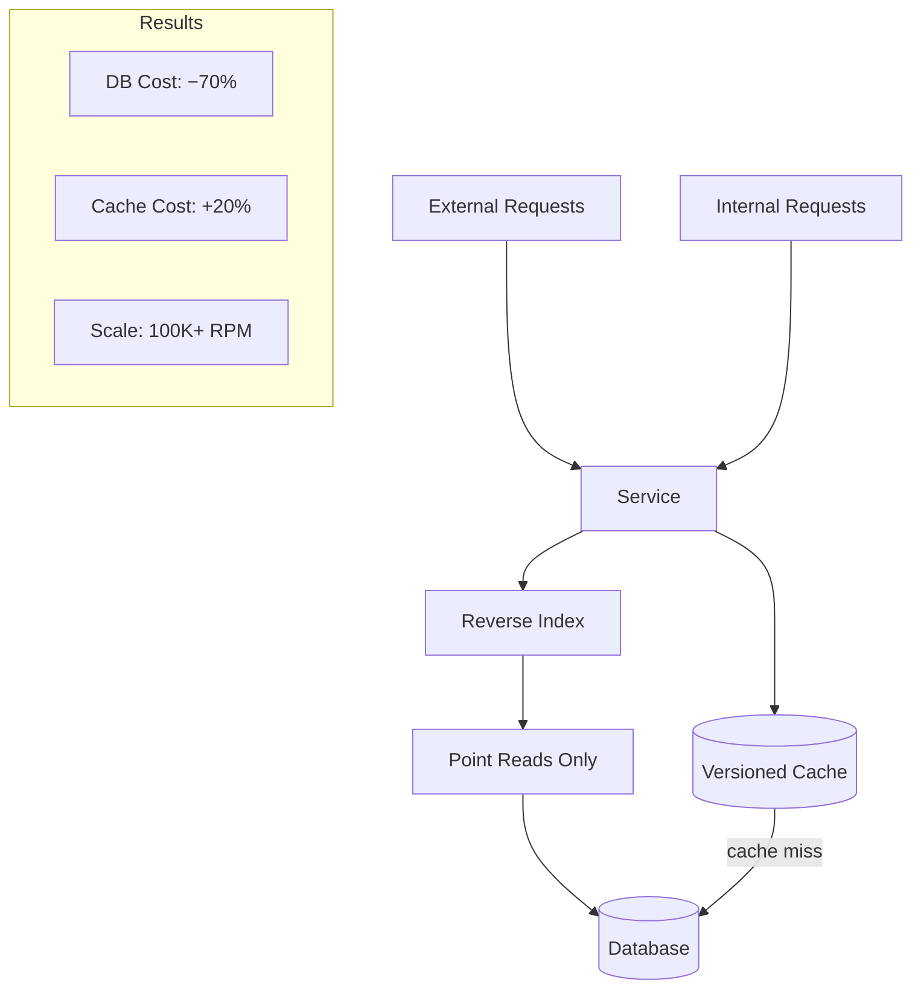

# Scaling a Configuration-Heavy Service

---

## 1. Baseline Problem

---

## 2. Point-Read Optimization

---

## 3. Reverse-Index Optimization

---

## 4. Cache Invalidation Tradeoff

---

## 5. Versioned Cache Design

---

## 6. Final System + Outcomes

